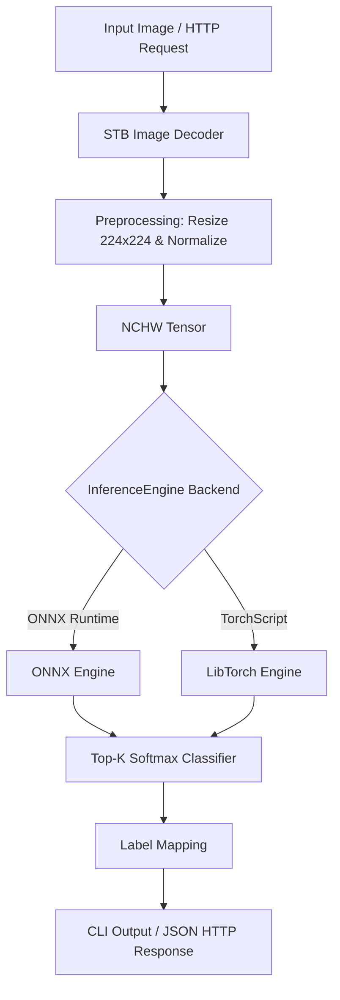

# 🚀 High-Performance C++ AI/ML Inference Engine

[](https://github.com/Sayak-420-abc/ai-ml-inference/actions/workflows/ci.yml)
[](https://en.wikipedia.org/wiki/C%2B%2B17)
[](https://github.com/Sayak-420-abc/ai-ml-inference)
[](https://onnxruntime.ai)
[](LICENSE)

A unified, high-performance C++ AI/ML inference pipeline supporting **ONNX Runtime** (CPU default, optional CUDA GPU acceleration) and optional **LibTorch** (TorchScript). Includes both a high-throughput CLI tool and a embedded REST API server for real-time computer vision inference.

---

## 📌 Key Features

- ⚡ **Unified Inference Engine**: Single C++ abstraction (`InferenceEngine`) seamlessly switching between ONNX Runtime and LibTorch backends.
- 🚀 **Hardware Accelerated**: Optimized for multi-threaded CPU execution with optional CUDA GPU acceleration support.
- 🌐 **Embedded REST API Server**: High-concurrency HTTP server powered by `cpp-httplib` for web/microservice integration (`POST /predict`).
- 🛠️ **Cross-Platform & Zero Setup**: Automated asset scripts (`.sh` / `.ps1`) download ONNX Runtime binaries, SqueezeNet models, and ImageNet labels automatically.
- 🛡️ **Runtime Safeguards**: Automatic runtime detection of CUDA dynamic libraries with friendly fallback warnings.
- 🐳 **Containerized & CI Ready**: Includes `Dockerfile` (CPU), `Dockerfile.gpu` (CUDA), VS Code Dev Containers configuration, and GitHub Actions CI matrix testing.

---

## 🏗 Architecture & Data Flow



---

## ⚡ Quickstart Guide

### 1. Prerequisites

- **CMake** $\ge$ 3.18
- **C++17 Compiler** (GCC 9+, Clang 10+, or MSVC 2019+)
- **Git** & **Curl**

---

### 2. Fetch Assets & Dependencies

Run the automated setup script for your platform:

**Linux / macOS / WSL (Bash):**
```bash
bash scripts/fetch_assets.sh
```

**Windows (PowerShell):**
```powershell
powershell -ExecutionPolicy Bypass -File scripts/fetch_assets.ps1
```

---

### 3. Build the Project

```bash
# Configure CMake
cmake -S . -B build -DBUILD_ONNXRUNTIME=ON -DBUILD_REST_API=ON

# Build Release binary
cmake --build build --config Release -j
```

---

### 4. Run CLI Inference

Classify an image and output top-$K$ predictions:

```bash
# Linux / macOS
./build/bin/highperf-ai-ml-inference --backend onnx --model models/squeezenet1.1.onnx --input assets/sample.jpg --topk 5

# Windows PowerShell / CMD
.\build\bin\Release\highperf-ai-ml-inference.exe --backend onnx --model models/squeezenet1.1.onnx --input assets/sample.jpg --topk 5
```

**Sample Output:**
```text
Top-5 indices: 263 264 162 265 161 
Scores: 0.8542 0.0912 0.0321 0.0110 0.0051 
Labels: Pembroke Welsh Corgi | Cardigan Welsh Corgi | Beagler | Toy Terrier | Basset Hound |
```

---

### 5. Launch REST API Server

Start the embedded REST API server on port 8080:

```bash
./build/bin/highperf-ai-ml-inference --serve 8080 --model models/squeezenet1.1.onnx
```

Query the prediction endpoint via `curl` or any HTTP client:

```bash
curl -X POST "http://localhost:8080/predict?file=assets/sample.jpg"
```

**JSON Response:**
```json
{
  "top_indices": [263, 264, 162, 265, 161],
  "top_scores": [0.8542, 0.0912, 0.0321, 0.0110, 0.0051],
  "top_labels": [
    "Pembroke, Pembroke Welsh corgi",
    "Cardigan, Cardigan Welsh corgi",
    "beagle",
    "toy terrier",
    "basset, basset hound"
  ]
}
```

---

## 🎮 GPU Acceleration (NVIDIA CUDA)

To build with CUDA support for ONNX Runtime:

```bash
# 1. Fetch CUDA-enabled ONNX Runtime binaries
ORT_USE_CUDA=1 bash scripts/fetch_assets.sh

# 2. Build (automatically links libonnxruntime_gpu.so)
cmake -S . -B build -DBUILD_ONNXRUNTIME=ON -DBUILD_REST_API=ON
cmake --build build --config Release -j
```

> **Note**: If compiled with GPU support on a system without active CUDA drivers, the application emits a friendly fallback warning at startup:
> `[warn] ONNX Runtime GPU library linked but CUDA runtime not detected...`

---

## 🛠 Advanced Options & TorchScript Support

### Building with LibTorch (TorchScript)

```bash
# 1. Fetch LibTorch binaries
bash scripts/fetch_libtorch.sh

# 2. Configure CMake with LibTorch enabled
cmake -S . -B build -DBUILD_ONNXRUNTIME=OFF -DBUILD_LIBTORCH=ON
cmake --build build --config Release -j
```

---

## 📖 CLI Reference

| Flag | Type | Default | Description |
| :--- | :--- | :--- | :--- |
| `--backend` | string | `onnx` | Inference backend (`onnx` or `libtorch`) |
| `--model` | string | `models/squeezenet1.1.onnx` | Path to trained model file (`.onnx` or `.pt`) |
| `--input` | string | `assets/sample.jpg` | Input image file path (`.jpg`, `.png`, `.bmp`) |
| `--labels` | string | `assets/imagenet_labels.txt` | Path to class labels text file |
| `--topk` | int | `5` | Number of top classification predictions to output |
| `--threads` | int | `1` | Number of CPU intra-op execution threads |
| `--serve` | int | `8080` (implicit) | Launch embedded HTTP REST server on specified port |
| `-h, --help` | flag | - | Show help message and command-line usage |

---

## 🐳 Docker Deployment

### CPU Docker Container
```bash
docker build -t highperf-ai-inference -f Dockerfile .
docker run --rm highperf-ai-inference
```

### NVIDIA GPU Docker Container
```bash
docker build -t highperf-ai-inference-gpu -f Dockerfile.gpu .
docker run --gpus all --rm highperf-ai-inference-gpu
```

---

## 🧪 Testing & CI

Run smoke tests via CTest:

```bash
ctest --test-dir build --output-on-failure
```

Automated matrix build and integration testing runs on every pull request via **GitHub Actions** across Ubuntu and Windows runner environments.

---

## 📁 Repository Structure

```text
.
├── .github/workflows/   # CI/CD matrix build workflows (Ubuntu + Windows)
├── .devcontainer/       # VS Code Dev Container & GitHub Codespaces configuration
├── include/             # Public API headers (infer_api.h)
├── src/                 # Engine implementations & REST server (main.cpp, backend_onnx, etc.)
├── scripts/             # Asset & dependency fetch scripts (fetch_assets.sh, fetch_assets.ps1)
├── CMakeLists.txt       # Cross-platform CMake build configuration
├── Dockerfile           # Production CPU container manifest
├── Dockerfile.gpu       # Production NVIDIA CUDA GPU container manifest
├── ARCHITECTURE.md      # Detailed system architecture document
└── README.md            # Repository documentation
```

---

## 📄 License

This project is licensed under the **MIT License**. See the [LICENSE](LICENSE) file for details.
